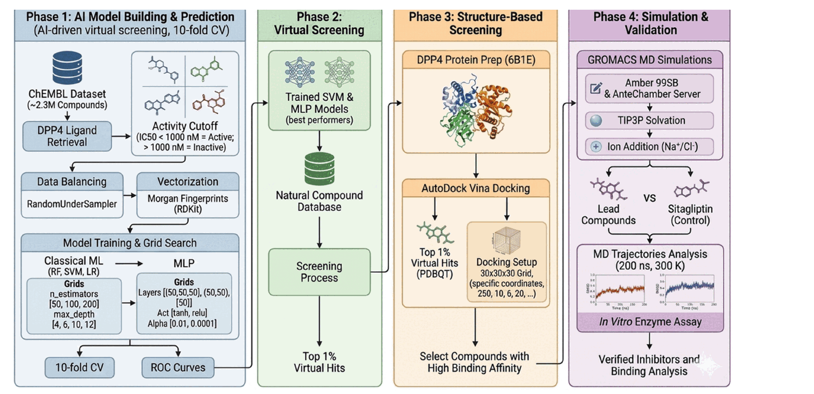
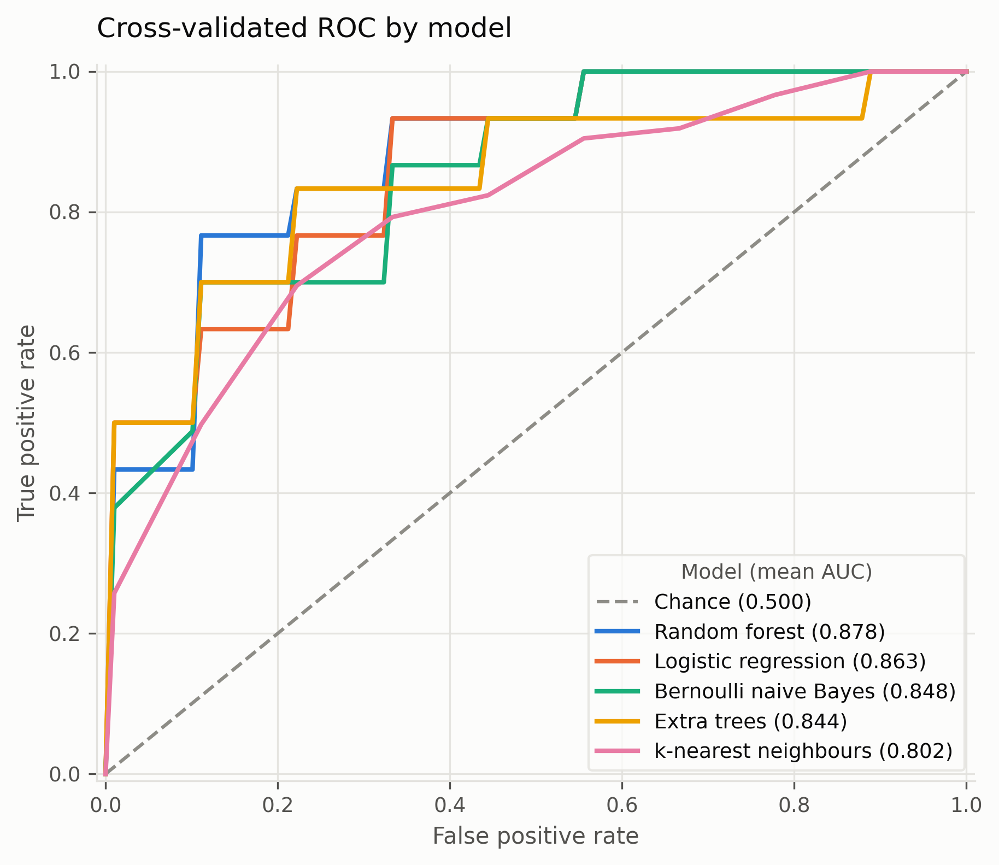
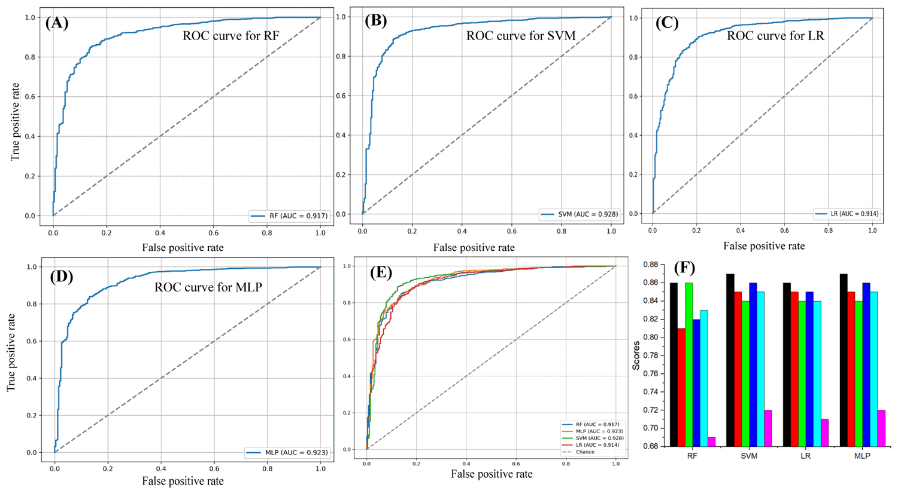

# MLvs — machine learning based virtual screening

[](https://doi.org/10.3390/ijms27125536)
[](LICENSE)
[](https://www.python.org/)

Ligand-based virtual screening where **you choose the models**. Point MLvs at a target, pick any combination of classical machine learning, ensemble, and deep learning classifiers, and it trains them all under the same cross-validation, compares them honestly, and ranks a compound library by their consensus.

The package and its command are both spelled `mlvs` in lowercase, following Python naming convention:

```python
import mlvs
```

Built for the DPP-4 natural product screen published in *International Journal of Molecular Sciences*, and generalised so the same workflow runs against any target.



*Study workflow from the paper. This package implements Phase 1 and Phase 2 — model building, prediction, and ligand-based screening. Docking, molecular dynamics, and in vitro validation use external tools.*

---

## Why this exists

Most screening pipelines hard-code two or three classifiers. Which algorithm wins depends on the target, the assay, and how the actives are distributed — so the choice should be a parameter, not a commitment baked into the source. Here every model is a registry entry addressed by name:

```bash
mlvs train --models rf,svm,lr,mlp          # the four from the paper
mlvs train --models all                     # everything installed
mlvs train --models ensemble                # every tree-based model
mlvs train --models xgb,lgbm,dnn            # boosting plus a deep network
```

Adding a model means adding one `ModelSpec` to `src/mlvs/models.py`. Nothing else changes — training, figures, screening, and consensus all pick it up automatically.

---

## Available models

| Key | Model | Family | Notes |
|---|---|---|---|
| `rf` | Random forest | ensemble | Robust default for fingerprints |
| `et` | Extra trees | ensemble | Faster to fit than RF |
| `gbm` | Gradient boosting | ensemble | scikit-learn boosted trees |
| `xgb` | XGBoost | ensemble | Optional: `pip install xgboost` |
| `lgbm` | LightGBM | ensemble | Optional: `pip install lightgbm` |
| `catboost` | CatBoost | ensemble | Optional: `pip install catboost` |
| `svm` | Support vector machine (RBF) | classical | Probability-calibrated |
| `linear_svm` | Linear SVM | classical | Calibrated; scales to large sets |
| `lr` | Logistic regression | classical | Regularised linear baseline |
| `knn` | k-nearest neighbours | classical | Jaccard metric for binary fingerprints |
| `nb` | Bernoulli naive Bayes | classical | Fast probabilistic baseline |
| `mlp` | Multilayer perceptron | deep | scikit-learn neural network |
| `dnn` | Deep neural network | deep | PyTorch, dropout + early stopping; `pip install torch` |

Shortcuts `all`, `classical`, `ensemble`, and `deep` expand to every installed model in that group. Run `mlvs models` for the live list, which marks what is installed.

**Featurisers** are selectable the same way: `morgan`, `atom_pair`, `topological_torsion`, `rdkit`, `maccs`, `descriptors`, and `morgan+descriptors`.

**Consensus methods** for combining model rankings: `mean_rank`, `median_rank`, `mean_score`, `rank_product`, and `borda`, optionally weighted by each model's cross-validated AUC.

---

## Install

```bash
git clone https://github.com/Ali-jarvis/AI-project-Drug-discovery.git
cd AI-project-Drug-discovery
pip install -e .

# optional extras
pip install -e ".[chembl]"    # ChEMBL data retrieval
pip install -e ".[boosting]"  # XGBoost + LightGBM
pip install -e ".[deep]"      # PyTorch
pip install -e ".[all]"
```

Python 3.9 or newer. Core dependencies are scikit-learn, RDKit, imbalanced-learn, pandas, and matplotlib.

---

## Quick start

```bash
# 1. See what you can select
mlvs models

# 2. Write a config you can edit
mlvs init -o config.yaml

# 3. Build a training set from ChEMBL (DPP-4, IC50 cutoff 1000 nM)
mlvs fetch --uniprot P27487 --threshold 1000 --project dpp4

# 4. Train and compare
mlvs train --project dpp4 --models rf,svm,lr,mlp --cv-folds 10

# 5. Screen a library and rank by consensus
mlvs screen --project dpp4 --library data/natural_products.csv --consensus mean_rank
```

Any config value the flags cover can be set on the command line instead, including
`--balance` on `train` and `--weight-by-auc` / `--top-fraction` on `screen`:

```bash
mlvs train  --project dpp4 --models all --balance oversample
mlvs screen --project dpp4 --library data/natural_products.csv \
            --consensus rank_product --weight-by-auc --top-fraction 0.02
```

Or run the whole thing from a config file:

```bash
mlvs run -c config/example_dpp4.yaml
```

### As a library

```python
from mlvs import featurise, train_models, score_library, consensus, select_top

X, mask = featurise(df["smiles"], method="morgan", n_bits=1024)
results = train_models(X, df.loc[mask, "label"], selection=["rf", "svm", "xgb"])

models = {k: r.estimator for k, r in results.items()}
ranked = consensus(score_library(models, library), method="rank_product")
hits = select_top(ranked, fraction=0.01)
```

---

## What a run produces

```
results/<project>/
├── dataset.csv              actives and inactives with their measured potency
├── models/<key>.joblib      one fitted pipeline per selected model
├── training_report.json     per-fold metrics, best hyperparameters, ROC curves
├── config_used.yaml         the exact settings the run used
├── model_metrics.csv        mean ± SD of eight metrics per model
├── screening_all.csv        every library compound, every model score, consensus rank
├── screening_top_hits.csv   top hits with physicochemical properties and Lipinski flags
└── figures/
    ├── roc_overlay.png      all models on one axis
    ├── roc_grid.png         one panel per model
    └── model_comparison.png ranked AUC with cross-validation spread
```



Reported metrics are AUC, average precision, accuracy, balanced accuracy, precision, recall, F1, and Matthews correlation — each as a mean and standard deviation across folds.

---

## How it avoids fooling you

Screening models are easy to overrate. Three choices here are deliberate:

**Resampling happens inside the cross-validation loop.** Class balancing runs as a step of an imbalanced-learn pipeline, so the held-out fold never sees resampled data. Balancing the whole dataset before splitting — a common shortcut — leaks information and inflates AUC.

**Reported metrics come from refitting in every fold**, not from the grid search's own best score, which is optimistic by construction.

**Duplicate measurements collapse to a median** before labelling, so one outlying assay reading cannot flip a compound's class.

An `ambiguous_margin` setting additionally discards compounds within a chosen band of the activity cutoff, where the active/inactive call is least reliable.

---

## Configuration

Every option lives in one YAML file; see [`config/example_dpp4.yaml`](config/example_dpp4.yaml).

```yaml
target:
  uniprot_id: P27487
  activity_type: IC50
  threshold: 1000.0        # IC50 < 1000 nM = active

features:
  method: morgan
  n_bits: 1024
  radius: 2

training:
  models: [rf, svm, lr, mlp]
  cv_folds: 10
  balance: undersample

screening:
  library: data/natural_products.csv
  consensus: mean_rank
  weight_by_auc: false
  top_fraction: 0.01
```

Command-line flags override the file, so one config can drive many variations.

---

## Included data

`data/natural_products.csv` holds 7,769 natural product structures (ZINC identifiers and SMILES) — the screening library used in the published DPP-4 work. Training sets are not shipped; `mlvs fetch` rebuilds them from ChEMBL so the data provenance is always current and reproducible.

---

## Reproducing the published screen

The paper trained RF, LR, SVM, and MLP on DPP-4 ChEMBL data at a 1000 nM IC<sub>50</sub> cutoff, took SVM and MLP as the best performers, and averaged their ranks to screen a natural product database:

```bash
mlvs fetch  --project dpp4 --uniprot P27487 --threshold 1000
mlvs train  --project dpp4 --models rf,lr,svm,mlp --cv-folds 10
mlvs screen --project dpp4 --library data/natural_products.csv \
            --models svm,mlp --consensus mean_rank
```



*Published results: ROC curves for (A) RF, (B) SVM, (C) LR, (D) MLP, (E) combined AUC comparison, and (F) balanced performance metrics. SVM and MLP reached AUC 0.928 and 0.923.*

Exact numbers will differ from the paper — ChEMBL grows over time, so a fetch today returns more compounds than the original 3,344 actives and 1,438 inactives. The top 1% of ranked compounds then proceed to docking and MD, which are outside this package; parameters for those steps are in the paper's Methods.

---

## Citation

If this software contributes to work you publish, please cite:

> Ali, S.; Shaikh, S.; Lim, J.H.; Lee, E.J.; Choi, I. Ensemble Machine Learning- and Deep Learning-Driven Identification and Validation of Sennidin B as a Novel Dipeptidyl Peptidase-4 Inhibitor. *Int. J. Mol. Sci.* **2026**, *27*, 5536. https://doi.org/10.3390/ijms27125536

<details>
<summary>BibTeX</summary>

```bibtex
@article{ali2026sennidinb,
  title   = {Ensemble Machine Learning- and Deep Learning-Driven Identification
             and Validation of Sennidin B as a Novel Dipeptidyl Peptidase-4 Inhibitor},
  author  = {Ali, Shahid and Shaikh, Sibhghatulla and Lim, Jeong Ho
             and Lee, Eun Ju and Choi, Inho},
  journal = {International Journal of Molecular Sciences},
  volume  = {27},
  number  = {12},
  pages   = {5536},
  year    = {2026},
  doi     = {10.3390/ijms27125536},
  publisher = {MDPI}
}
```
</details>

Figures 1 and 2 in this README are reproduced from that article, which is open access under [CC BY 4.0](https://creativecommons.org/licenses/by/4.0/).

---

## Related work

The modular target-to-hits structure follows an approach established by the TAME-VS platform: Bian, Y.; Kwon, J.J.; Liu, C.; Margiotta, E.; Shekhar, M.; Gould, A.E. Target-driven machine learning-enabled virtual screening (TAME-VS) platform for early-stage hit identification. *Front. Mol. Biosci.* **2023**, *10*, 1163536. https://doi.org/10.3389/fmolb.2023.1163536

This package is an independent implementation and shares no code with it.

---

## Development

```bash
pip install -e ".[dev]"
pytest -q
```

---

## Licence

MIT — see [LICENSE](LICENSE).

## Author

**Dr. Shahid Ali** — [ali.ali.md111@gmail.com](mailto:ali.ali.md111@gmail.com)
ORCID [0000-0002-4724-5086](https://orcid.org/0000-0002-4724-5086)
